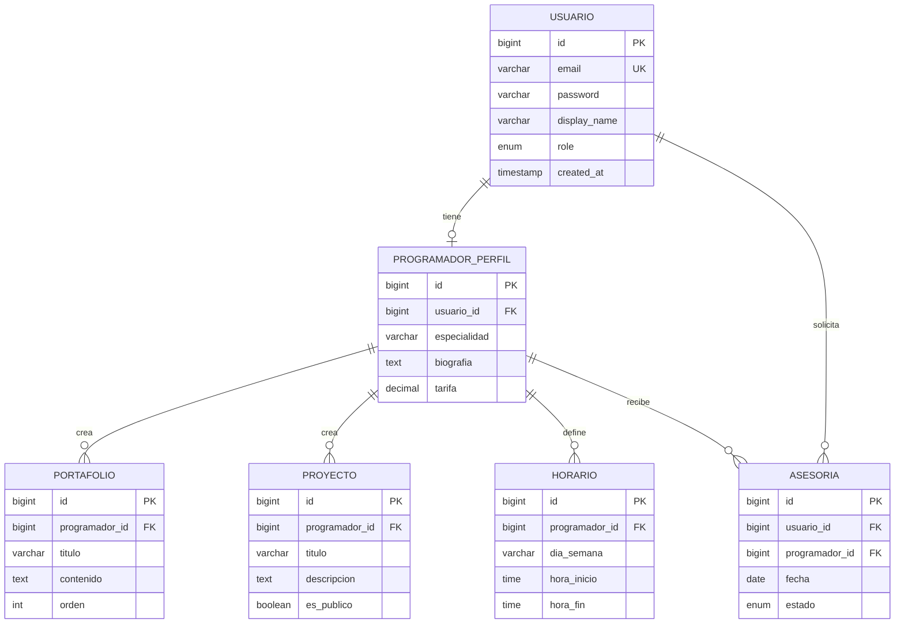

# Backend Portafolio - Sistema de Gestión de Portafolios y Asesorías

<div align="center">

[](https://openjdk.org/)
[](https://spring.io/projects/spring-boot)
[](https://www.postgresql.org/)
[](https://www.docker.com/)
[](https://gradle.org/)

</div>

---

## Descripción

Sistema backend para la gestión de portafolios profesionales multiusuario con sistema integrado de asesorías. Permite a un administrador crear usuarios programadores, donde cada programador puede gestionar su propio portafolio con proyectos personalizados. Incluye un sistema completo de asesorías donde usuarios externos pueden solicitar reuniones con los programadores.

### Proyecto Integrador

**Asignatura**: Programación y Plataformas Web  
**Institución**: Universidad Politecnica Salesiana 
**Período**: P67 
**Docente**: Ing. Pablo Torres

---

## Tabla de Contenidos

- [Características Principales](#características-principales)
- [Arquitectura](#arquitectura)
- [Tecnologías Utilizadas](#tecnologías-utilizadas)
- [Instalación y Configuración](#instalación-y-configuración)
- [Despliegue](#despliegue)
- [API Endpoints](#api-endpoints)
- [Seguridad](#seguridad)
- [Base de Datos](#base-de-datos)
- [Documentación](#documentación)
- [Autores](#autores)

---

## Características Principales

### Autenticación y Seguridad
- **JWT (JSON Web Tokens)** para autenticación stateless
- **Sistema de roles**: ADMIN, PROGRAMMER, EXTERNAL
- **Endpoints protegidos** con Spring Security
- **Encriptación de contraseñas** con BCrypt

### Gestión de Usuarios
- CRUD completo de usuarios
- Perfiles diferenciados por rol
- Perfiles de programador con información profesional
- Gestión de datos personales y profesionales

### Gestión de Portafolios
- Creación de secciones personalizadas
- Gestión de proyectos con estados (público/privado)
- Sistema de tags y categorización
- Integración con Cloudinary para imágenes

### Sistema de Asesorías
- Registro de horarios de disponibilidad
- Solicitud y gestión de asesorías
- Estados: Pendiente, Confirmada, Rechazada, Completada, Cancelada
- Filtros avanzados por programador, fecha y estado
- Dashboard con estadísticas en tiempo real

### Notificaciones Automatizadas
- Correos electrónicos automáticos vía JavaMail
- Notificaciones al crear, confirmar o rechazar asesorías
- Recordatorios programados 30 minutos antes de la asesoría
- Templates HTML personalizados

### Reportes y Dashboard
- Reportes en PDF descargables (OpenPDF)
- Dashboard con estadísticas de asesorías
- Dashboard con estadísticas de proyectos
- Filtros por programador, fecha y estado
- **Paginación en servicios clave** para optimización de rendimiento

### Gestión de Imágenes
- Integración con Cloudinary para almacenamiento
- Upload de imágenes con validación
- URLs optimizadas y CDN

---

## Arquitectura

### Patrón de Diseño
- **Arquitectura en Capas** (Layered Architecture)
- **Patrón Repository** para acceso a datos
- **DTOs** (Data Transfer Objects) para transferencia de datos
- **Mappers** para conversión entre entidades y DTOs

### Estructura del Proyecto

```
src/main/java/com/backend/proyecto/
├── auth/                      # Autenticación y registro
│   ├── controllers/
│   ├── dtos/
│   └── services/
├── security/                  # Configuración de seguridad
│   ├── JwtTokenProvider
│   ├── JwtAuthenticationFilter
│   └── CustomUserDetailsService
├── config/                    # Configuraciones
│   ├── SecurityConfig
│   ├── CorsConfig
│   ├── CloudinaryConfig
│   └── OpenApiConfig
├── Usuarios/                  # Gestión de usuarios
├── Programadores/             # Perfiles de programadores
├── Proyectos/                 # Gestión de proyectos
├── Portafolios/              # Secciones de portafolio
├── Horarios/                  # Horarios de disponibilidad
├── asesorias/                 # Sistema de asesorías
├── reportes/                  # Generación de reportes
├── PanelDeControl/           # Dashboard y estadísticas
├── notifications/            # Servicio de notificaciones
├── utils/                    # Utilidades
└── exceptions/               # Manejo de excepciones
```

---

## Tecnologías Utilizadas

<div align="center">

### Backend Framework

<a href="https://spring.io/projects/spring-boot" target="_blank">
  
</a>
&nbsp;&nbsp;&nbsp;
<a href="https://openjdk.org/" target="_blank">
  
</a>
&nbsp;&nbsp;&nbsp;
<a href="https://gradle.org/" target="_blank">
  
</a>

### Base de Datos

<a href="https://www.postgresql.org/" target="_blank">
  
</a>

### DevOps & Cloud

<a href="https://www.docker.com/" target="_blank">
  
</a>
&nbsp;&nbsp;&nbsp;
<a href="https://render.com/" target="_blank">
  
</a>
&nbsp;&nbsp;&nbsp;
<a href="https://cloudinary.com/" target="_blank">
  
</a>

</div>

### Stack Tecnológico Completo

| Categoría | Tecnología | Versión | Propósito |
|-----------|-----------|---------|-----------|
| **Runtime** | Java OpenJDK | 21 | Lenguaje de programación |
| **Framework** | Spring Boot | 4.0.2 | Framework backend |
| **ORM** | Hibernate | 6.x | Mapeo objeto-relacional |
| **Base de Datos** | PostgreSQL | 16 | Base de datos relacional |
| **Seguridad** | Spring Security | 6.x | Autenticación y autorización |
| **JWT** | JJWT | 0.12.3 | JSON Web Tokens |
| **Documentación** | SpringDoc OpenAPI | 2.8.4 | Swagger/OpenAPI |
| **PDF** | OpenPDF | 1.3.30 | Generación de reportes |
| **Email** | Spring Mail | 4.0.2 | Envío de correos |
| **Cloud Storage** | Cloudinary HTTP44 | 1.35.0 | Gestión de imágenes |
| **Build Tool** | Gradle | 8.13 | Gestión de dependencias |
| **Containerization** | Docker | - | Containerización |
| **Deployment** | Render | - | Hosting cloud |

---

## Instalación y Configuración

### Prerequisitos

- Java 21 o superior
- PostgreSQL 16
- Gradle 8.13+
- (Opcional) Docker

### 1. Clonar el Repositorio

```bash
git clone https://github.com/Alanissette16/Backend-Portafolio.git
cd Backend-Portafolio
```

### 2. Configurar Base de Datos

Crear base de datos en PostgreSQL:

```sql
CREATE DATABASE foreing;
```

### 3. Configurar Variables de Entorno

Editar `src/main/resources/application.yaml` o configurar variables de entorno:

```yaml
# Database
SPRING_DATASOURCE_URL=jdbc:postgresql://localhost:5432/foreing
SPRING_DATASOURCE_USERNAME=postgres
SPRING_DATASOURCE_PASSWORD=tu_password

# JWT
JWT_SECRET=tu_clave_secreta_jwt

# Email
MAIL_USERNAME=tu_email@gmail.com
MAIL_PASSWORD=tu_app_password

# Cloudinary
CLOUDINARY_CLOUD_NAME=tu_cloud_name
CLOUDINARY_API_KEY=tu_api_key
CLOUDINARY_API_SECRET=tu_api_secret

# CORS
CORS_ORIGINS=http://localhost:4200
```

### 4. Compilar y Ejecutar

#### Opción A: Con Gradle

```bash
# Compilar
./gradlew clean build

# Ejecutar
./gradlew bootRun
```

#### Opción B: Con Docker

```bash
# Build
docker build -t portafolio-backend .

# Run
docker run -p 8080:8080 \
  -e SPRING_DATASOURCE_URL=jdbc:postgresql://host.docker.internal:5432/foreing \
  -e SPRING_DATASOURCE_USERNAME=postgres \
  -e SPRING_DATASOURCE_PASSWORD=tu_password \
  portafolio-backend
```

### 5. Verificar Instalación

- **API**: http://localhost:8080
- **Swagger UI**: http://localhost:8080/swagger-ui/index.html
- **Health Check**: http://localhost:8080/actuator/health

---

## Despliegue

### Despliegue en Render

#### Pasos Rápidos

1. Crear cuenta en [Render.com](https://render.com)
2. Crear PostgreSQL Database (Plan Free)
3. Crear Web Service con Runtime: **Docker**
4. Configurar variables de entorno
5. Deploy automático

**Guía completa**: Ver [DEPLOYMENT_GUIDE.md](./DEPLOYMENT_GUIDE.md)

### URLs de Producción

```
API Backend: https://portafolio-backend.onrender.com
Swagger Docs: https://portafolio-backend.onrender.com/swagger-ui/index.html
Health Check: https://portafolio-backend.onrender.com/actuator/health
```

---

## API Endpoints

### Autenticación

```http
POST   /api/auth/register      # Registro de usuario
POST   /api/auth/login         # Inicio de sesión
GET    /api/auth/me            # Obtener usuario actual
```

### Usuarios

```http
GET    /api/usuarios                    # Listar todos (ADMIN)
GET    /api/usuarios/{id}               # Obtener por ID
POST   /api/usuarios                    # Crear usuario (ADMIN)
PUT    /api/usuarios/{id}               # Actualizar usuario
DELETE /api/usuarios/{id}               # Eliminar usuario (ADMIN)
GET    /api/usuarios/programadores      # Listar programadores
```

### Programadores

```http
GET    /api/programadores              # Listar todos
GET    /api/programadores/{id}         # Obtener por ID
PUT    /api/programadores/me/{id}      # Actualizar perfil propio
```

### Proyectos

```http
GET    /api/proyectos                  # Listar todos
GET    /api/proyectos/publicos         # Proyectos públicos
GET    /api/proyectos/{id}             # Obtener por ID
POST   /api/proyectos                  # Crear proyecto
PUT    /api/proyectos/{id}             # Actualizar proyecto
DELETE /api/proyectos/{id}             # Eliminar proyecto
```

### Portafolios

```http
GET    /api/portafolios                        # Listar secciones
GET    /api/portafolios/programador/{id}      # Por programador
POST   /api/portafolios                        # Crear sección
PUT    /api/portafolios/{id}                   # Actualizar sección
DELETE /api/portafolios/{id}                   # Eliminar sección
```

### Horarios

```http
GET    /api/horarios/programador/{id}         # Horarios de programador
POST   /api/horarios                           # Crear horario
PUT    /api/horarios/programador/{id}          # Reemplazar horarios
DELETE /api/horarios/{id}                      # Eliminar horario
```

### Asesorías

```http
GET    /api/asesorias                          # Listar todas
GET    /api/asesorias/mias                     # Mis asesorías (EXTERNAL)
GET    /api/asesorias/programador/{id}         # Por programador
POST   /api/asesorias                          # Solicitar asesoría
PUT    /api/asesorias/{id}/confirmar           # Confirmar asesoría
PUT    /api/asesorias/{id}/rechazar            # Rechazar asesoría
PUT    /api/asesorias/{id}/completar           # Marcar completada
DELETE /api/asesorias/{id}                     # Cancelar asesoría
```

### Reportes

```http
GET    /api/reportes/asesorias.pdf            # Descargar reporte PDF
       ?programadorId=1&desde=2024-01-01&hasta=2024-12-31
       
GET    /api/reportes/proyectos.pdf            # Reporte de proyectos PDF
       ?programadorId=1&activo=true
```

### Dashboard

```http
GET    /api/dashboard/asesorias               # Estadísticas de asesorías
       ?programadorId=1&desde=2024-01-01&hasta=2024-12-31
       
GET    /api/dashboard/proyectos               # Estadísticas de proyectos
       ?programadorId=1
```

### Imágenes

```http
POST   /api/images/upload                     # Subir imagen a Cloudinary
```

---

## Seguridad

### Roles y Permisos

| Endpoint | ADMIN | PROGRAMMER | EXTERNAL | Público |
|----------|:-----:|:----------:|:--------:|:-------:|
| POST /api/auth/register | ✓ | ✓ | ✓ | ✓ |
| POST /api/auth/login | ✓ | ✓ | ✓ | ✓ |
| GET /api/proyectos/publicos | ✓ | ✓ | ✓ | ✓ |
| GET /api/programadores | ✓ | ✓ | ✓ | ✓ |
| POST /api/usuarios | ✓ | ✗ | ✗ | ✗ |
| PUT /api/programadores/me/* | ✗ | ✓ | ✗ | ✗ |
| POST /api/asesorias | ✗ | ✗ | ✓ | ✗ |
| GET /api/dashboard/* | ✓ | ✓ | ✗ | ✗ |

### Headers Requeridos

```http
Authorization: Bearer <jwt_token>
Content-Type: application/json
```

### Autenticación JWT

1. Usuario se autentica en `/api/auth/login`
2. Sistema retorna JWT token
3. Cliente incluye token en header `Authorization: Bearer <token>`
4. Token válido por 24 horas

---

## Base de Datos

### Modelo de Datos



---

## Documentación

### Swagger UI

La documentación completa de la API está disponible en Swagger UI:

- **Local**: http://localhost:8080/swagger-ui/index.html
- **Producción**: https://portafolio-backend.onrender.com/swagger-ui/index.html

### Características de la Documentación

- Todos los endpoints documentados
- Modelos de datos (DTOs) con validaciones
- Ejemplos de request/response
- Pruebas interactivas
- Autenticación JWT integrada

---

## Testing

### Ejecutar Tests

```bash
./gradlew test
```

### Coverage Report

```bash
./gradlew jacocoTestReport
```

---

## Flujo de Trabajo

### Registro y Autenticación

1. Usuario se registra mediante `POST /api/auth/register`
2. Sistema crea usuario con rol EXTERNAL
3. Usuario inicia sesión mediante `POST /api/auth/login`
4. Sistema retorna JWT token
5. Cliente incluye token en todas las peticiones

### Solicitud de Asesoría

1. Usuario EXTERNAL consulta horarios disponibles
2. Usuario solicita asesoría mediante `POST /api/asesorias`
3. Sistema envía notificación por email al programador
4. Programador confirma o rechaza la asesoría
5. Sistema envía confirmación por email al usuario
6. Sistema programa recordatorio automático 30 minutos antes

### Gestión de Portafolio

1. Admin crea usuario con rol PROGRAMMER
2. Programador actualiza su perfil profesional
3. Programador crea y gestiona proyectos
4. Programador organiza secciones de su portafolio
5. Proyectos públicos son visibles para todos los usuarios

---

## Mejoras Futuras

- Tests unitarios y de integración completos
- Implementación de caché con Redis
- Webhooks para notificaciones en tiempo real
- Métricas y monitoreo con Spring Actuator
- Rate limiting para protección de API
- Pipeline CI/CD con GitHub Actions
- Sistema de logs centralizados

---

## Autores

**Valeria Mantilla & Claudia Quevedo**  
Estudiantes de Computación - Universidad Politecnica Salesiana

---

## Licencia

Este proyecto es parte de un proyecto académico para la asignatura de Programación y Plataformas Web.

---

## Soporte

Para problemas o preguntas:

- **Email**: alanissette.mantilla2004@gmail.com
- **Documentación**: [Swagger UI](https://portafolio-backend.onrender.com/swagger-ui/index.html)
- **Issues**: [GitHub Issues](https://github.com/Alanissette16/Backend-Portafolio/issues)

---

## Agradecimientos

- **Ing. Pablo Torres** - Docente de la asignatura
- **Universidad Politecnica Salesiana**
- Comunidad de Spring Boot y PostgreSQL

---

<div align="center">

**Desarrollado con Spring Boot**

[Volver arriba](#backend-portafolio---sistema-de-gestión-de-portafolios-y-asesorías)

</div>
